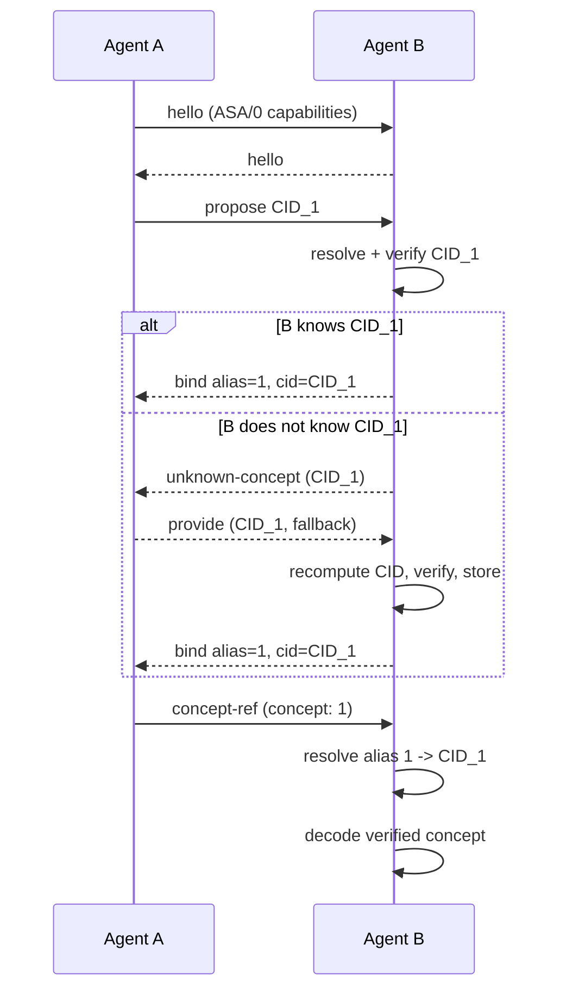

# ASA/0 Prototype

> Minimal working prototype demonstrating content-addressed semantic concepts
> with session-local alias negotiation between two independent agents.

## What ASA/0 demonstrates

1. **Canonical identity** — a concept's global identity is derived entirely from its semantic content (definition + constraints + relations). No publisher, timestamp, or signature influences the CID.
2. **Deterministic CID generation** — two logically identical concepts always produce the same DAG-CBOR bytes and the same CIDv1 (sha2-256).
3. **Local content-addressed store** — concepts are cached by CID on the filesystem; resolution always re-verifies the hash.
4. **Session-local alias negotiation** — after exchanging a CID, two agents agree on a compact integer alias (starting at 1) for the rest of the session. The alias is disposable and never persisted as global identity.
5. **Unknown-concept fallback** — when a peer doesn't know a CID, the sender provides an inline fallback payload. The receiver recomputes the CID, verifies it matches, and stores it. If it doesn't match, the message is refused.
6. **Integrity verification** — tampered stored bytes are detected and rejected on every resolution attempt.
7. **Unknown-alias safety** — receiving an alias that was never negotiated triggers an explicit error rather than a guess.
8. **Transport-size benchmark** — measures the cumulative UTF-8 byte cost of verbose JSON, full CID references, and ASA aliases (including one-time negotiation overhead).

## What ASA/0 does NOT demonstrate

- No networking, IPFS, or HTTP resolution (only local filesystem and in-memory transport).
- No signatures, DIDs, or trust/attestation layers.
- No registry, discovery, or search.
- No embeddings or vector databases.
- No MCP, A2A, or other host-protocol integration.
- No governance, evolution assertions, or ontology reasoning.
- No token-count measurements (only UTF-8 byte counts).
- No persistence of session aliases across restarts.
- No multi-agent or multi-session orchestration.

## Canonical identity model

The identity-bearing object is:

```ts
type ConceptCore = {
  asa: "concept/v0"
  definition: string
  constraints?: Record<string, unknown>
  relations?: Array<{ predicate: string; target: string }>
}
```

Before encoding:

- `constraints` and `relations` are omitted when absent or empty.
- `undefined` entries are stripped from `constraints`.

The result is encoded as **DAG-CBOR**, which sorts map keys by (length, byte order) — so JavaScript object insertion order does not affect the output.

## CID generation

```
CID = CIDv1(codec=0x71 dag-cbor, multihash=sha2-256(dagCbor(normalize(concept))))
```

- CIDv1 (version=1)
- Codec: dag-cbor (`0x71`)
- Hash: sha2-256 (`0x12`)
- Text representation: base32 (`bafyrei...`)

Test vectors are in `tests/vectors.json` and can be regenerated with `npx tsx scripts/generate-vectors.ts`.

## Local resolution

The `LocalStore` writes objects to `.asa/objects/<cid>` as raw DAG-CBOR bytes. The `LocalResolver` reads the file and calls `verifyBytes()` which:

1. Parses the CID string to extract version, codec, and multihash.
2. Recomputes sha2-256 of the stored bytes.
3. Compares the digest to the CID's embedded digest.
4. Returns false (or throws `VerificationError`) on any mismatch.

The `Resolver` interface is designed so that IPFS or HTTP resolvers can be added later by implementing `resolve(cid: string): Promise<Uint8Array | null>`.

## Alias negotiation



Aliases are allocated starting at 1 and incrementing within each agent's `SessionDictionary`. Both agents must record the binding independently.

## Fallback

When a peer does not know a CID:

1. Receiver sends `{ kind: "unknown-concept", cid }`.
2. Sender replies with `{ kind: "provide", cid, fallback: { definition, constraints?, relations? } }`.
3. Receiver rebuilds `ConceptCore` from fallback, computes CID, verifies it matches the claimed CID.
4. If matched: stores locally and proceeds with negotiation.
5. If mismatched: sends `{ kind: "refuse", cid, reason: "fallback-cid-mismatch" }`. No alias is bound.

## Benchmark methodology

The benchmark measures **UTF-8 byte sizes** of JSON wire messages, not token counts.

- **Verbose JSON**: the full `ConceptCore` inlined in every message.
- **Full CID**: `{ concept: "<cid>" }` per message (73 B for this concept).
- **ASA alias**: `{ concept: <alias> }` per message (13 B), plus a one-time negotiation overhead measured by running a real cold-peer negotiation.

Break-even is computed as `ceil(negotiation_overhead / (baseline_bytes - alias_bytes))`.

## Limitations

- The in-memory `SimulatedTransport` is synchronous within the event loop — it does not model network latency, reordering, or packet loss.
- The `LocalStore` uses CID strings as filenames; on case-insensitive filesystems, this is safe because base32 is lowercase-only, but filesystems with filename length limits (e.g., 255 chars on most Unix) could truncate very long CID encodings.
- The `conceptCID()` function is async only because `multiformats` uses async hashing; if performance mattered, a synchronous path could be added.
- No LRU eviction or alias unbinding is implemented; a malicious peer could exhaust memory by proposing unlimited concepts. The `SessionDictionary` is bounded only by available memory.
- The benchmark measures UTF-8 bytes, not tokens. Actual LLM token counts depend on the tokenizer and may differ significantly.
